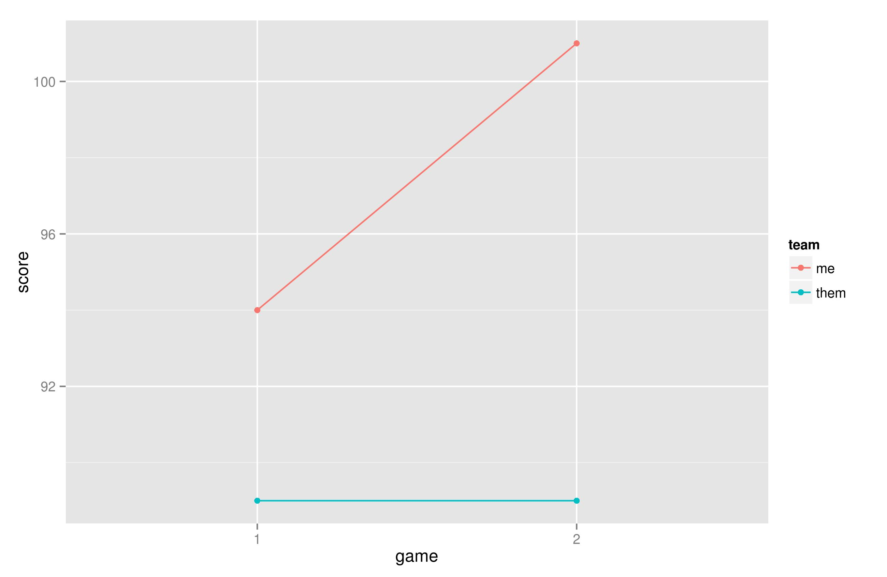

Updated: 9/16/2014

I recently created [a gist](https://gist.github.com/corynissen/7676784) that demonstrated how to authenticate with the Yahoo API, using the [httr package](http://cran.r-project.org/web/packages/httr/). In this post, I will expand on this a little to downloading personal Yahoo fantasy football data and creating a graph showing my regular season results.  

The first step, obviously, is to authenticate with the Yahoo API and get a signature to attach to all of the requests. This entails [registering an application with Yahoo](https://developer.apps.yahoo.com/dashboard/createKey.html) and getting API keys. [This page](https://developer.yahoo.com/oauth/guide/oauth-auth-flow.html#oauth-consumerkey) has information about the auth process. I have my credentials saved to a text file that I read in, but you can use environment variables too, whatever you are comfortable with.
```{r eval=FALSE}
library(httr)
library(XML)
library(RJSONIO)
library(ggplot2)

# saved my yahoo keys to a file, now, read them in...
creds <- read.table("~/cn/personal/keys/yahoo.txt", stringsAsFactors=F)
consumer.key <- creds[1,1]
consumer.secret <- creds[2,1]
oauth_endpoints("yahoo")
myapp <- oauth_app("yahoo", key = consumer.key, secret = consumer.secret)
token <- oauth1.0_token(oauth_endpoints("yahoo"), myapp)
```
  
Next, you have to discover your game key, league key, and team key. You will need your league id that is in the URL when you visit your normal Yahoo fantasy football page. My league id should not work for you, as mine is a private league.  
```{r eval=FALSE}
# need to get game id for my league...
ff.url <- "http://fantasysports.yahooapis.com/fantasy/v2/game/nfl?format=json"
game.key.json <- GET(ff.url, config(token = token))
game.key.list <- fromJSON(as.character(game.key.json), asText=T)
game.key <- game.key.list$fantasy_content$game[[1]]["game_key"]

# my personal leagueid, you will have to use your own, mine is private
league.id <- "262101"
league.key <- paste0(game.key, ".l.", league.id)
league.url <- "http://fantasysports.yahooapis.com/fantasy/v2/league/"
```  

Next, I had to figure out my team id. This was trial and error for me. I'm not sure if there's a better way. Using the matchups endpoint, I can get the data for all of my games for the regular season (2 games as of today). The data is available as XML or JSON. I choose JSON with the "?format=json" at the end of the URL. Then, using the [RJSONIO package](http://cran.r-project.org/web/packages/RJSONIO/index.html), I parsed the data to create two vectors, my score for every week, and my opponent's score for every week. The JSON is nested deeply, so this is kinda ugly...
```{r eval=FALSE}
my.team.id <- "4"
my.team.key <- paste0(league.key, ".t.", my.team.id)
team.url <- "http://fantasysports.yahooapis.com/fantasy/v2/team/"
# lots of endpoints to play with, more here... 
# http://developer.yahoo.com/fantasysports/guide/
my.team.stats.json <- GET(paste0(team.url, my.team.key, "/stats?format=json"), 
                          config(token = token))
my.team.standings.json <- GET(paste0(team.url, my.team.key, 
  "/standings?format=json"), config(token = token))
my.team.matchups.json <- GET(paste0(team.url, my.team.key, 
  "/matchups?format=json"), config(token = token))
my.team.matchups.list <- fromJSON(as.character(my.team.matchups.json), asText=T)

# number of games played
game.num <- 2

# get the opponent scores for my matchups for the entire season
tmp <- my.team.matchups.list$fantasy_content["team"][[1]][[2]]$matchups
opp.score <- tmp$'0'$matchup$`0`$teams$`1`$team[[2]]$team_points["total"]
opp.score <- c(opp.score, sapply(as.character(1:(game.num-1)),   
  function(x)tmp[x][[x]]$matchup$`0`$teams$`1`$team[[2]]$team_points$total))
my.score <- tmp$'0'$matchup$`0`$teams$`0`$team[[2]]$team_points["total"]
my.score <- c(my.score, sapply(as.character(1:(game.num-1)),   
  function(x)tmp[x][[x]]$matchup$`0`$teams$`0`$team[[2]]$team_points$total))
```  

Almost there... now we just have to make a dataframe in the format that ggplot2 likes to have...
```{r eval=FALSE}
my.df <- data.frame(cbind(game=rep(1:length(my.score), 2), 
  team=c(rep("me", length(my.score)), rep("them", length(my.score))),
  score=as.numeric(c(my.score, opp.score))))
my.df$game <- factor(my.df$game, levels=1:game.num)
my.df$score <- as.numeric(as.character(my.df$score))
```  

Then we can graph it using [ggplot2](http://cran.r-project.org/web/packages/ggplot2/index.html). Here's the code and output...
```{r eval=FALSE}
p1 <- ggplot(my.df, aes(x=game, y=score, color=team, group=team)) + 
  geom_point() + geom_line() + scale_y_continuous()
ggsave("FF_regular_season.jpg")
```  



There's a bunch more that can be done with this API, the point of this post was to show how to get through the auth stuff and show a simple demonstration of the API.

Follow me on twitter for more R tidbits like this... https://twitter.com/corynissen


